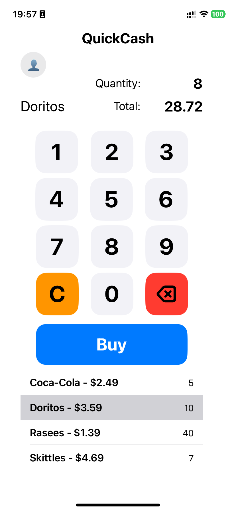
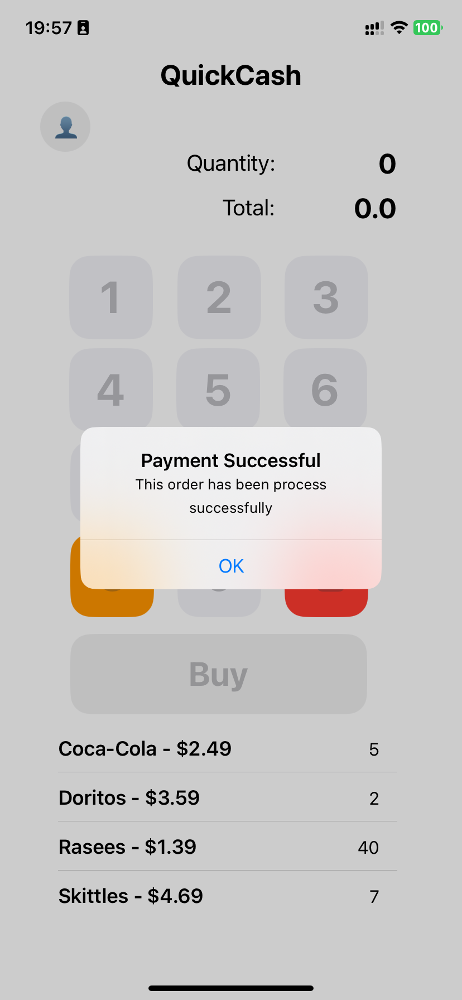
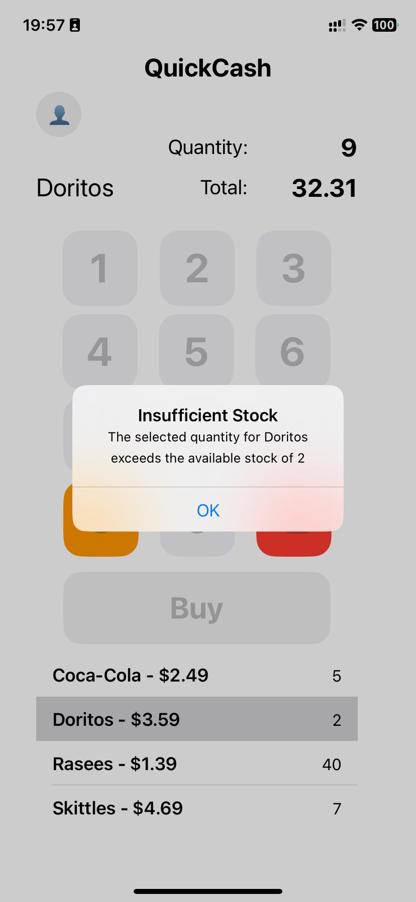
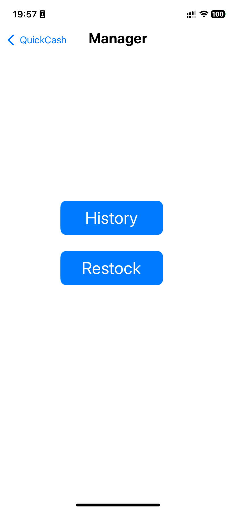
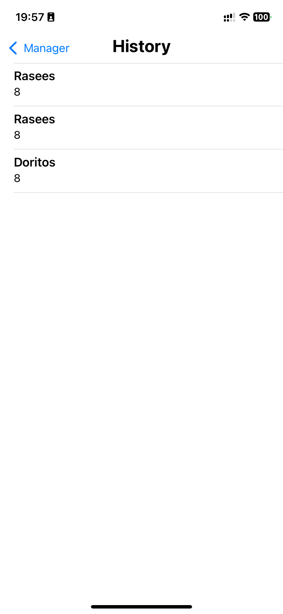
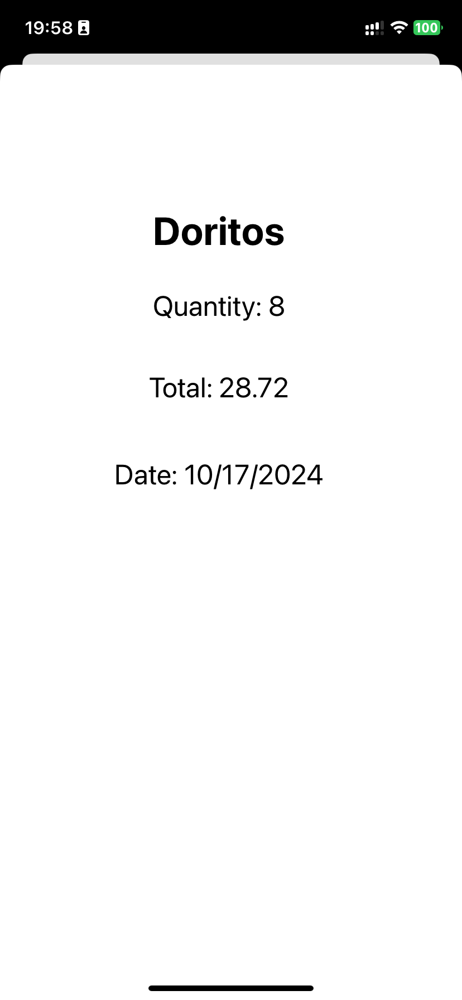
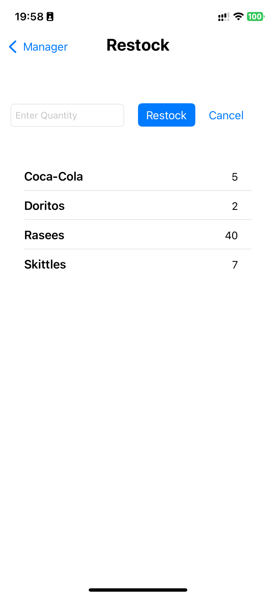
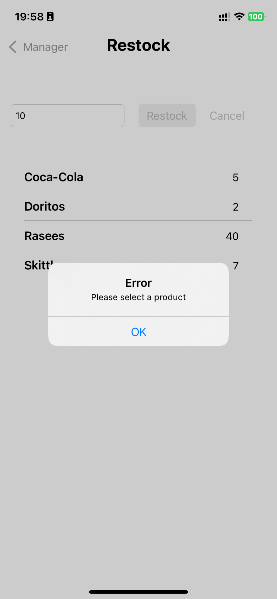
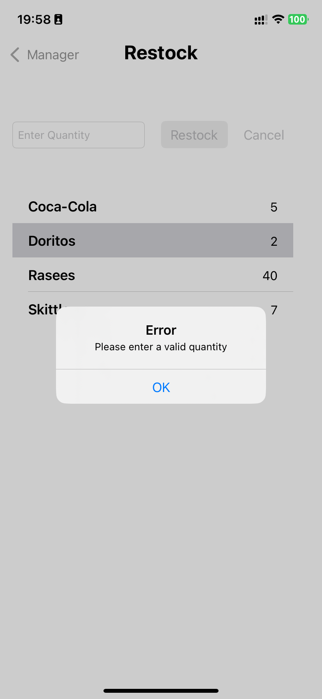
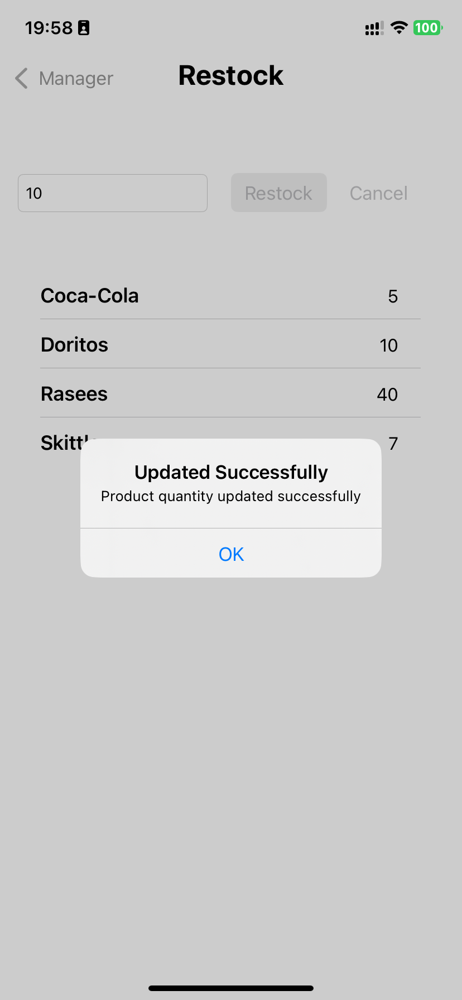

# QuickCash App
The Cash Register Application for iOS allows users to manage product purchases, track sales, and maintain product inventory with ease. Users can select items from a product list, input quantities, and calculate the total cost for checkout. The app includes essential features such as a checkout process, where users can complete transactions, receive alerts for insufficient stock, and update inventory automatically after a sale.

# Installation
- Clone the repository: `git clone https://github.com/r-sachdeva3105/QuickCash.git`
- Open the project in Xcode (or Android Studio for a cross-platform app).
- Build and run the app on a simulator or physical device.

# Demo
A video demonstrating the app, its features, and input validation can be found here: [Demo]()

# Screenshots

  
  
  
  
  
  
  
  
  
  

